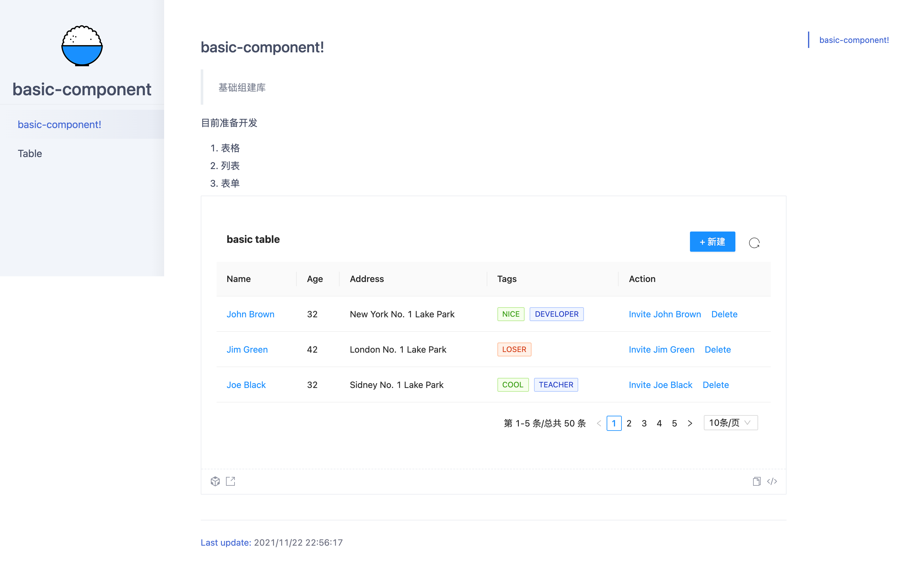

# basic-component



## Getting Started

Install dependencies,

```bash
$ npm i
```

Start the dev server,

```bash
$ npm start
```

Build documentation,

```bash
$ npm run docs:build
```

Build library via `father-build`,

```bash
$ npm run build
```
